# birdseye-web screenshots

From the [demo stack](../demo/README.md): a local NetBird with a fictional company “Acme”. Images follow your GitHub theme (light or dark). Setup and configuration: [web-ui.md](web-ui.md).

| | |
|---|---|
| [Access matrix](#access-matrix) | [Cell details and quick edit](#cell-details-and-quick-edit) |
| [Reachability](#reachability) | [Group editor](#group-editor) |
| [User editor](#user-editor) | [Policy editor](#policy-editor) |
| [Resources](#resources) | [Anomalies](#anomalies) |
| [Audit log](#audit-log) | [Config history](#config-history) |
| [Restore](#restore) | [Jobs](#jobs) |

## Access matrix

Who may access whom, here Group × Group. Cell colours tell the service at a glance: all protocols, ports, ICMP, NetBird SSH; a corner mark means posture-gated. Rows and headers link to their editors.

<picture>
  <source media="(prefers-color-scheme: dark)" srcset="screenshots/matrix-dark.png">
  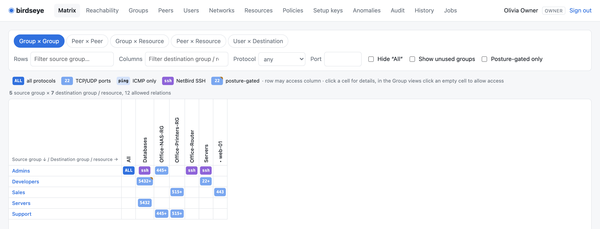
</picture>

## Cell details and quick edit

Click a cell: which policy and rule allow the access, and one-click actions (remove a group from the rule, disable or delete the policy) – each previewed before it is written.

<picture>
  <source media="(prefers-color-scheme: dark)" srcset="screenshots/matrix-cell-dark.png">
  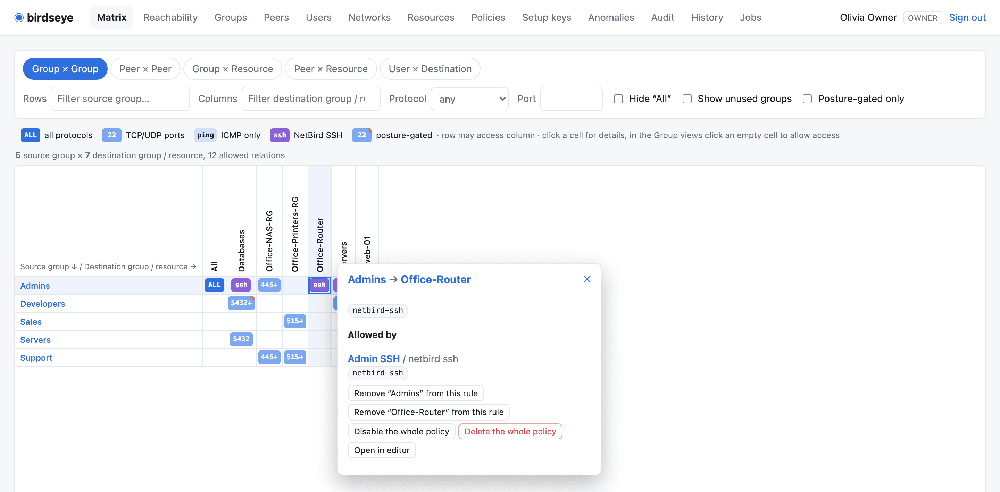
</picture>

## Reachability

“Can ben-laptop reach db-01 on tcp/5432?” – yes, through *Dev to databases*, posture-gated.

<picture>
  <source media="(prefers-color-scheme: dark)" srcset="screenshots/reachability-dark.png">
  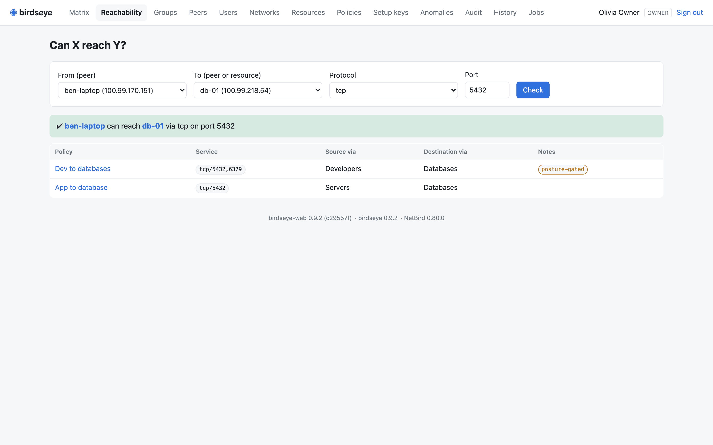
</picture>

## Group editor

Peers and users of a group. Ticking a peer shows on the right which access is gained or lost – before anything is saved.

<picture>
  <source media="(prefers-color-scheme: dark)" srcset="screenshots/group-editor-dark.png">
  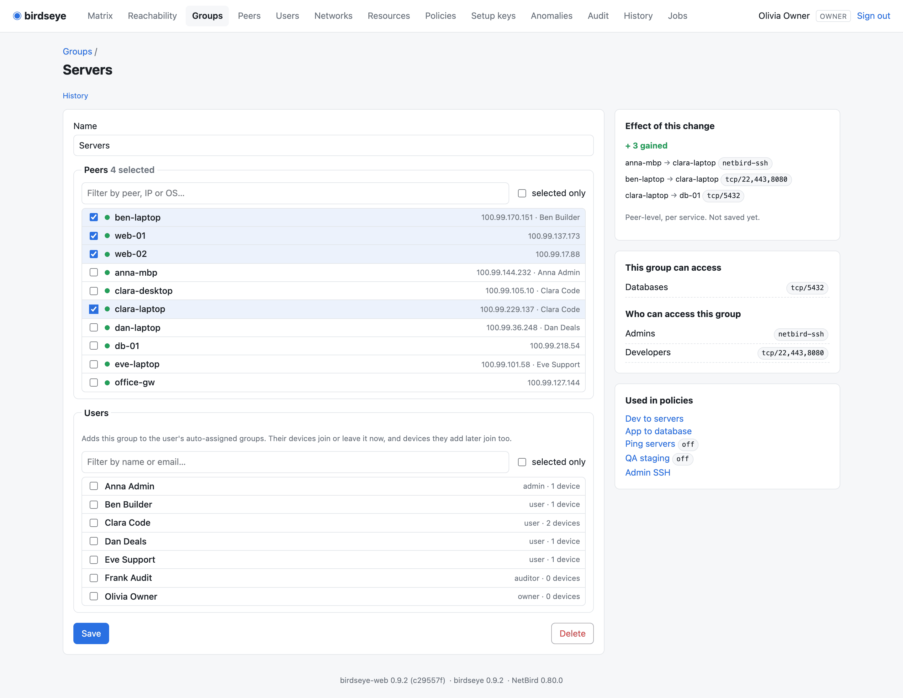
</picture>

## User editor

Role, block state, auto-assigned groups, and the user's devices. A device whose groups drifted from the user's defaults is marked and can be fixed with one tick.

<picture>
  <source media="(prefers-color-scheme: dark)" srcset="screenshots/user-editor-dark.png">
  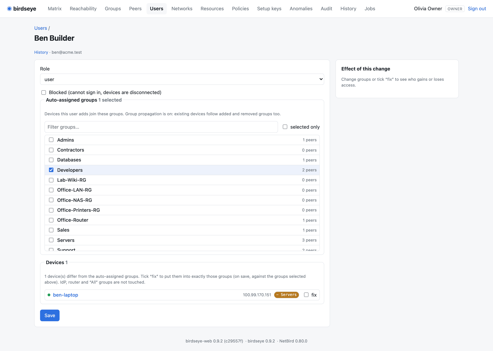
</picture>

## Policy editor

Multi-rule policies with posture checks, ports, `netbird-ssh` and bidirectional rules, with the same live preview.

<picture>
  <source media="(prefers-color-scheme: dark)" srcset="screenshots/policy-editor-dark.png">
  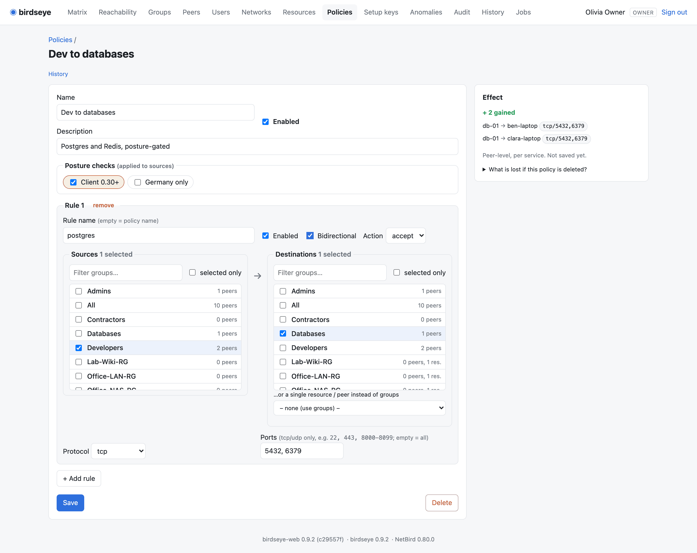
</picture>

## Resources

Every network resource: address and size (subnets flagged – least privilege prefers `/32`), router state, resource groups, the policies that reach it and how many peers actually can.

<picture>
  <source media="(prefers-color-scheme: dark)" srcset="screenshots/resources-dark.png">
  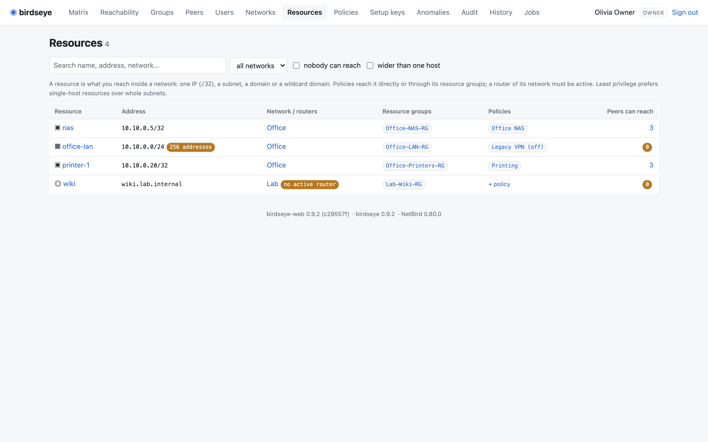
</picture>

## Anomalies

Configuration smells: rules aimed at single peers, drifted devices, unrouted or unreachable resources, unused groups and posture checks, risky setup keys, stale or outdated peers. Each links to the editor that fixes it.

<picture>
  <source media="(prefers-color-scheme: dark)" srcset="screenshots/anomalies-dark.png">
  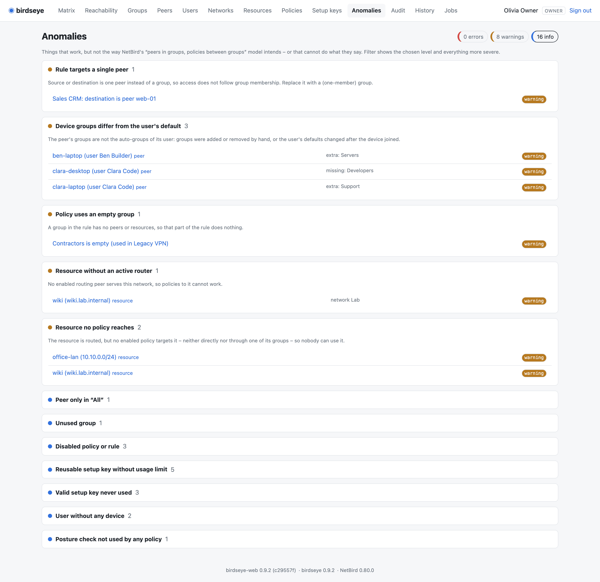
</picture>

## Audit log

NetBird's audit events with names instead of IDs, filters, links to the editors and to each object's config versions; changes made in birdseye-web are marked.

<picture>
  <source media="(prefers-color-scheme: dark)" srcset="screenshots/audit-dark.png">
  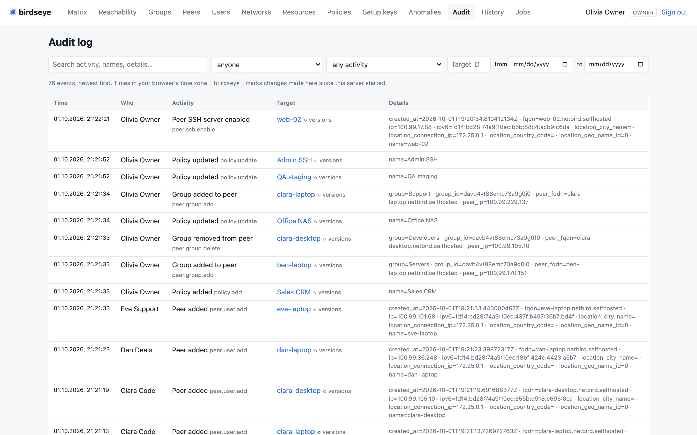
</picture>

## Config history

Compare two snapshots of the configuration, field by field. Snapshots follow every change within seconds.

<picture>
  <source media="(prefers-color-scheme: dark)" srcset="screenshots/history-dark.png">
  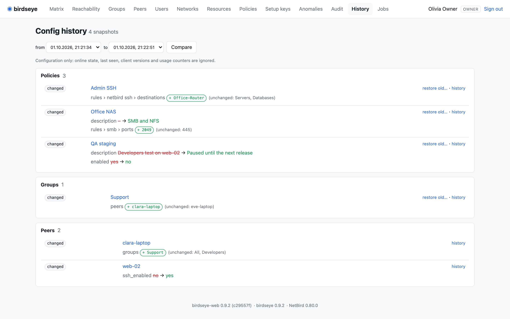
</picture>

## Restore

Restore one policy or group to an older version, with the access it would change shown first.

<picture>
  <source media="(prefers-color-scheme: dark)" srcset="screenshots/history-restore-dark.png">
  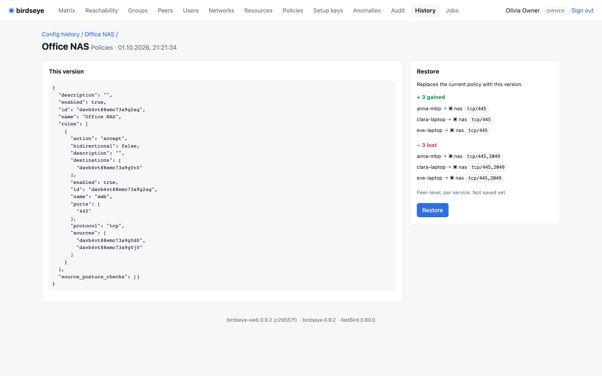
</picture>

## Jobs

The birdseye container's cron jobs and audit-event forwarder: last run, result, history, log tail; owners and admins can start selected jobs.

<picture>
  <source media="(prefers-color-scheme: dark)" srcset="screenshots/jobs-dark.png">
  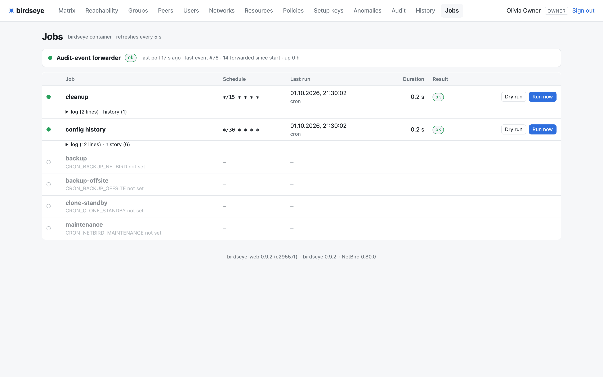
</picture>

---

Regenerate: `cd demo && ./up.sh`, then `uv run --project .. --with playwright python shoot.py` and `uv run --project .. python publish_docs.py`. Only when the UI visibly changed – every run adds to the repository.
